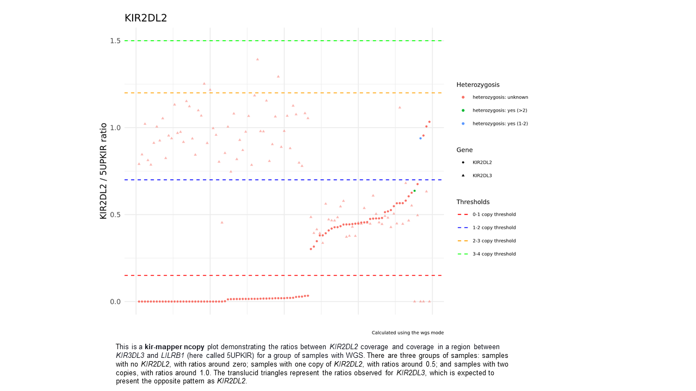

kir-mapper manual
=======

Version 1.0 (Nov, 2024)

Author: Erick C. Castelli (erick.castelli@unesp.br)


## Summary


[Important notes](#important-notes)

[Install](#install)

[kir-mapper configuration](#kir-mapper-configuration)

[How to use kir-mapper](#how-to-use-kir-mapper)

[-- Aligning reads to the hg38 reference genome - map](#aligning-reads-to-the-hg38-reference-genome---map)

[-- Estimating copy numbers - ncopy](#estimating-copy-numbers---ncopy)

[-- Calling SNPs and alleles - genotype](#calling-snps-and-alleles---genotype)

[-- Calling haplotypes and solving ambuguites - haplotype](#calling-haplotypes-and-solving-ambiguites---haplotype)

[Other methods](#other-methods)

[Practical notes](#practical-notes)

[Support](#support)


## Important notes:

Data compatibility: We tested kir-mapper with Illumina short-read data from whole-genome sequencing (WGS), whole-exome sequencing (WES), and targeted sequencing. It might work with Ion Torrent with some adjustments.

System compatibility: MacOS (Intel), Linux, or WSL2/Linux. We have tested it with MacOS 10.15, Ubuntu 22.04 LTS, and Ubuntu 22.04 LTS under WSL2. Other versions might be compatible. For MacOS, we tested only with Intel Macs.

Read depth: Please note that read depth is essential. We recommend coverage of at least 20x for WGS and 50x for WES. 

Read size: You will get much better results when dealing with a read size larger than 100 nucleotides and paired-end sequencing. kir-mapper is also compatible with single-end sequencing data. The pipeline may produce biased results with shorter reads ( < 100).

Sample size: The minimum sample size we tested is 50 samples. The sample size is essential to get accurate estimations for copy numbers. 

Always indicate the full path for any input file or output folder. For example, do not use "~" for your home folder.


[Back to Summary](#summary)
<br/><br/>

## Install

Please refer to the [README.md](README.md) for instructions on how to install kir-mapper.

[Back to Summary](#summary)

<br/><br/>

## kir-mapper configuration

Remember, you need a copy of the kir-mapper database to run any analysis. 

```
	wget --no-check-certificate https://www.castelli-lab.net/support/kir-mapper_db_latest.zip
	unzip kir-mapper_db_latest.zip
```

kir-mapper uses a hidden configuration file (.txt) in your home folder containing the path for all necessary programs. If the program does not find this file, it enters the setup mode automatically. You can also call this mode by typing `kir-mapper setup` 

```
	kir-mapper setup
```

Follow the instructions provided to indicate the path of all necessary programs. kir-mapper might find the programs automatically. The only exception is the database and the PICARD jar file. 

The setup process will save the configuration file in your home folder.

 This is an example of this file. **USER** must be replaced by your username. You can check it with `nano ~/.kir-mapper`:

	db=/home/USER/kir-mapper/kir-mapper_db_latest/
	samtools=/home/USER/miniconda3/envs/kir-mapper/bin/samtools
	bcftools=/home/USER/miniconda3/envs/kir-mapper/bin/bcftools
	bwa=/home/USER/miniconda3/envs/kir-mapper/bin/bwa
	whatshap=/home/USER/miniconda3/envs/kir-mapper/bin/whatshap
	freebayes=/home/USER/miniconda3/envs/kir-mapper/bin/freebayes
	picard=/home/USER/miniconda3/envs/kir-mapper/bin/picard.jar
	star=/home/USER/miniconda3/envs/kir-mapper/bin/STAR
	shapeit4=/home/USER/miniconda3/envs/shapeit4/bin/shapeit4


[Back to Summary](#summary)
<br/><br/>

## How to use kir-mapper

kir-mapper is a toolkit with methods for aligning, genotyping, and inferring haplotypes. You can see all functions by running the program without any parameter.
```
	kir-mapper
```

These are the commands (or functions) available:


|Command|Description|
|---|---|
|setup|to configure kir-mapper|
|map|to map/align sequences (WGS, WES, Amplicons)|
|ncopy|to detect copy numbers|
|genotype|to call SNPs, InDels, and alleles|
|haplotype|to estimate haplotypes within and among KIR genes, and call alleles|
|group|to combine multiple kir-mapper runs|
|join|to join variants into a single VCF for plink|
|select|to preselect KIR-like sequences|

<br/><br/>
In brief, there are **four main methods**, that should be used in this specific order:
- map
- ncopy
- genotype
- haplotype

[Back to Summary](#summary)
<br/><br/>

### Aligning reads to the hg38 reference genome - map

This function will align or realign reads to KIR genes. Type `kir-mapper map` to check all options.

	Usage: kir-mapper map [OPTIONS]
	Required:
		-r1  STRING and -r2 STRING: path to paired-end read files
			 or
		-r0  STRING: path to single-end read file
			 or
		-bam STRING: path to BAM file (reads aligned to the hg38 reference with BWA-MEM)

		-output STRING: full path to the output folder.
		
		
	Optional:
		-sample STRING: name/id for the sample

  		-db          path to the kir-mapper database
		(indicate an alternative path for the database)

  		-output      output folder
  		(indicate the output folder - default is next to the BAM or FASTQ file)
		
		-threads     number of threads [half the number of cores]
  		(the number of threads - max 10)

		-buffer      number of sequences in buffer [1000000]
  		(how many sequences should be processed at the same time. Do not change this!)

		-error       threshold for nucleotide quality trimming [0.08]
		(bases with less than 92% of likelihood will be ignored)

  		-tolerance   fraction of mismatches allowed [0.05, from 0.01 to 0.10]
		(the maximum fraction of mismatches allowed between a sequence and a known KIR allele)
		(error and tolerance influence each other)

  		-downsample  downsampling for the adjustment [30]
		(read downsampling to speed up the adjustment process. Do not change this!)

  		--skip-unmapped   skip retrieving unmapped reads [not recommended]
		(Do not process unmapped reads. You should avoid using this.)

  		--skip-adjust     skip the adjustment procedure [not recommended]
		(kir-mapper will not try to recover reads that align in two or more genes.)
		(You should not change this!)

  		--low-mem         force low memory mode for sequence selection
		(Use the low memory algorithm. kir-mapper will use this automatically when necessary.)

  		--exome           this is an exome (only exons)
		*****(This is exome data!)****

  		--quiet           quiet mode
		Do not output any messages.

<br/><br/>
**Attention: You should always provide the full path for the inputs and for the output folder.**

<br/><br/>
This is an example of a sample tagged as "Test." "Test" will be the name of the sample in all outputs.
```	
	# Re-aligning a BAM file
	kir-mapper map -bam original_BAM.bam -sample test -output /home/USER/output 

	# Aligning FASTQ 
	kir-mapper map -r1 R1.fastq.gz -r2 R2.fastq.gz -sample test -output /home/USER/output

	# Re-aligning a BAM file from exome
	kir-mapper map -bam original_BAM.bam -sample test -output /home/USER/output --exome
```

**Note for exomes: you should indicate the --exome flag.**

<br/><br/>
When evaluating many samples simultaneously, run `map` for every sample, indicating the same output but different sample names. Example:

```	
	kir-mapper map -bam Teste1_BAM.bam -sample Test1 -output /home/USER/output 
	kir-mapper map -bam Teste2_BAM.bam -sample Test2 -output /home/USER/output 
	kir-mapper map -bam Teste3_BAM.bam -sample Test3 -output /home/USER/output 

```

The outputs from `map` are placed in a folder named "map" inside the output folder. Inside the "map" folder, you will find a folder for each sample processed using the same output but different sample names. 

The outputs include BAM files with aligned reads to the hg38 reference genome and gene-specific fastq files. The final BAM is the ".adjusted.bam" when not using PICARD tools or ".adjusted.nodup.bam" when using PICARD tools. 

The BAM files produced by kir-mapper may be used in downstream analysis, such as GATK or freebayes genotyping.

You may inspect the BAM files using [IGV](https://igv.org/). In IGV, change the genome for "Human (hg38 1kg/GATK)" and open the ".adjusted.bam" or ".adjusted.nodup.bam" file. For KIR genes annotated at the main chr19 sequence (e.g., KIR3DL3), type the gene name of the gene to locate it. For genes that are not annotated at the main chr19 chromosome, these are their locations in alternative contigs were kir-mapper places the alignments:

- KIR2DL2,	chr19_KI270921v1_alt:53185-67900
- KIR2DL5AB, chr19_KI270921v1_alt:175661-185557
- KIR2DS1, chr19_KI270921v1_alt:204223-218437
- KIR2DS2, chr19_KI270921v1_alt:36890-51500
- KIR2DS3, chr19_KI270921v1_alt:81118-95700
- KIR2DS5, chr19_KI270890v1_alt:36829-52100
- KIR3DP1, chr19_KI270923v1_alt:61981-67693
- KIR3DS1, chr19_KI270921v1_alt:159375-174162

<br/><br/>

Files produced by the `map` function:

|File|Description|
|---|---|
|.ajustede.bam|BAM file with with all reads - you should use this one
|.adjusted.nodup.bam|BAM file with all reads and mark duplicates - you should use this one|
|.unique.bam|BAM file with only uniquely mapped reads|
|.unique.nodup.bam|BAM file with only uniquely mapped reads and mark duplicates|
|.kir-mapper.log|Log file with configuration and sample details|
|addressing_table.txt.gz|Table with all reads and the score for each KIR gene|
|GENE.fastq.gz|Gene-specific fastq files.|
|presence_report.txt|report indicating which KIR gene is present. It does not indicate copy numbers.|


[Back to Summary](#summary)

<br/><br/>

### Estimating copy numbers - ncopy

This function will estimate the number of copies for every KIR gene and sample. The `map` function must be used before `ncopy` for every sample. 

**Attention: kir-mapper tries to estimate copy numbers for LILR genes (LILRB1, LILRB2, etc). However, this is still in beta mode and the results should not be considered.**

	Usage: kir-mapper ncopy [OPTIONS]
	Required:
		-output STRING: full path to the output folder. This is the same folder used by function map.
		
	Optional:
	 	-db          path to the kir-mapper database
		(indicate an alternative path for the database)

		-threads     number of threads [half the number of cores]
  		(the number of threads - max 20)

		-reference   KIR3DL3,5UPKIR,HLA-E,HLA-G [default: KIR3DL3]
		(this is the reference used to calculate copy number.)
		(when selecting a reference, user assumes that all samples present 2 copies of that reference)
		(5UPKIR is a region upstream of KIR3DL3, between KIR3DL3 and LILRB1, that is only available for WGS data)
  		
		-samples     text file listing the samples to consider
		(this a text file with the names of the samples [one per line] that you want to process)
		(by default, kir-mapper uses all samples inside the /map folder)
		
  		--exome           this is an exome (only exons)
		*****(This is exome data!)****

  		--quiet           quiet mode
		Do not output any messages.


Examples
```	
	kir-mapper ncopy -output /home/USER/output 
	kir-mapper ncopy -output /home/USER/output --exome
	kir-mapper ncopy -output /home/USER/output --exome -reference 5UPKIR
```

**Note for exomes: you should indicate the --exome flag.**
<br/><br/>
Note that you must indicate the same output folder used in the previous step (`map`).

The outputs from `ncopy` are placed in a " ncopy " folder inside the output folder. 

This function will estimate the number of copies for every KIR gene and sample. The final outputs are plots in PNG and HTML formats with the coverage ratio between the target gene and the selected reference. 

To evaluate the thresholds, please open in a browser the .html files from /home/**USER**/output/ncopy/plots. For each gene, define the thresholds to separate samples with 0, 1, 2, 3, or >3 copies, changing these thresholds on the thresholds.txt file inside /home/**USER**/output/ncopy. Each threshold is separated with ":".

If you change any threshold value, you must run `kir-mapper ncopy` again to reflect these changes. This will update all the plots and the copy numbers for all samples.

This is an example of the plot, and how the thresholds should be defined.



**Attention: The default reference is KIR3DL3. You can set HLA-G, HLA-E, or 5UPKIR as a reference to check whether KIR3DL3 is a valid reference, with two copies for every individual. However, please use the default KIR3DL3 reference whenever possible.**

<br/><br/>
Alternatively, you can use the R script named `kir-mapper_plot_app.R` inside the output/ncopy folder. This script can assist you in defining the thresholds and updating the plots. When using this script, there is no need to run `ncopy` again in case you change any threshold. To run it, use `Rscript kir-mapper_plot_app.R`.

<br/><br/>
Inside the " ncopy " folder, you will find some files that might be usefull:

|File|Description|
|---|---|
|copy_numbers.table.txt|copy numbers in a table format|
|copy_numbers.txt|copy numbers in a list format|
|depth_values.txt|the depth of coverage observed in each gene|
|ratio_values.txt|the target/referece ratios|
|presence.table.txt|presence or absence of each gene in a table format|
|presence.table.vcf|presence or absence of each gene in a VCF format|
|thresholds.txt|the thresholds used to separate groups|
|kir-mappler_plot_app.R|the script for changing the thresholds|
|/plots| all the plots in HTML and PNG formats|


[Back to Summary](#summary)

<br/><br/>

### Calling SNPs and alleles - genotype

This function will call SNPs and InDels across KIR genes and evaluate how these variants fit known KIR alleles. 

	Usage: kir-mapper genotype [OPTIONS]
	Required:
		-output STRING: full path to the output folder. The same used by function map and ncopy.
		
	Optional:
		-threads INT: number of threads
		
		--full: call SNPs and Indels also in introns
		(BETA: by default, genotype calls SNPs and InDels only in exons)
		(This flag tells kir-mapper to call variants also in introns)

		--nopolyphase   skip phasing tri/tetraploids
		(do not phase with whatshap when there are more than 2 copies of a gene)

	  	--two_copies    force two copies when gene is present
	  	(force 2 copies for every gene that was detected in the sample)

	  	--update_calls  update allele calls considering the available VCF

		

Example
```	
	kir-mapper genotype -output /home/USER/output 
```
<br/><br/>
Note that you must indicate the same output folder used in the previous step (map and ncopy).

The outputs from `genotype` are placed in a " genotype " folder inside the output folder. By default, variants are called only in exons and placed under the folder " genotype/cds ". When using `--full` variants are placed under the folder " genotype/full ".

This function will call SNPs and InDels across all exons from KIR genes, using freebayes and an internal algorithm to detect and remove unlike genotypes. It also phases the variants using whatshap. After, the program detects which KIR alleles are compatible with the observed variants.

The outputs are VCF files for every gene and reports with the detected alleles for every sample, listing eventual mismatches.

The VCF files are placed inside /home/**USER**/output/genotype/cds/[GENE_NAME]/vcf

The reports for each sample are placed inside /home/**USER**/output/genotype/cds/[GENE_NAME]/reports

The summary with all allele calls is placed inside /home/**USER**/output/genotype/cds/[GENE_NAME]/calls

All the SNPs are reported in the context of the hg38 reference genome. For genes not annotated in the primary sequence of chr19 (e.g., KIR2DL5), reads from these genes are aligned and reported in an alternative contig.

These are the locations for all genes in the alternative contigs:

- KIR2DL2,	chr19_KI270921v1_alt:53185-67900
- KIR2DL5AB, chr19_KI270921v1_alt:175661-185557
- KIR2DS1, chr19_KI270921v1_alt:204223-218437
- KIR2DS2, chr19_KI270921v1_alt:36890-51500
- KIR2DS3, chr19_KI270921v1_alt:81118-95700
- KIR2DS5, chr19_KI270890v1_alt:36829-52100
- KIR3DP1, chr19_KI270923v1_alt:61981-67693
- KIR3DS1, chr19_KI270921v1_alt:159375-174162

<br/><br/>
This is an example of the report for a sample named Test and gene KIR2DL1. Reports are placed at the output folder inside /genotype/cds/[GENE_NAME]/reports


|Sample|Copy_number|Chr|Allele_A|Allele_B|Allele_C|Allele_D|Tested_genotypes|Valid_genotypes|Error_list|Missed_genotypes|Missed_list|Ratio|
|---|---|---|---|---|---|---|---|---|---|---|---|---|
|Test|1|chr19|KIR2DL1.01202|KIR2DL1*null|NA|NA|77|77|none|0|none|1.000000|
|Test|1|chr19|KIR2DL1.00303|KIR2DL1*null|NA|NA|81|80|54775198|1|54784020|0.987654|

In this case, the sample named Test has only one copy of KIR2DL1, which is compatible with allele KIR2DL1* 01202. It tested 77 SNPs, and 77 SNPs were compatible with this allele. There were no missing variants or mismatches, and the proportion of valid variants / tested variants was 1.00 (100%). There is a second record for allele KIR2DL1* 00303, but, in this case, there is one mismatch at position chr19:54775198 and one missing variant at chr19:54784020. The ratio between valid variants / tested variants (80 / 81) was 0.9876.

After analyzing all samples, kir-mapper will produce a summarised report with all samples. This report is at /genotype/cds/[GENE_NAME]/calls/[GENE_NAME].calls.txt. This report will present the best fit for each sample. In case the best match is related to many different allele combinations, you may find the indication of "*unresolved".


 Example:
|Sample|Copy_number|Calls|Ratio|Missings|
|---|---|---|---|---|
|Test|1|KIR2DL1.01202+KIR2DL1*null|1|0|
|Test2|2|KIR2DL1*00302+KIR2DL1*00401;KIR2DL1*00302+KIR2DL1*035|1|1|


**Attention: You should not allow calls with too many missing variants. Missing variants occur when read size is too short (< 100) or coverage is too low (< 20 for WGS, < 50 for WES>). In addition, calls with ratio < 1 indicate possible new alleles, and the allele combination indicated is the closest one.**

<br/><br/>
Sometimes, `kir-mapper genotype` reports ambiguities, i.e., more than one combination of alleles that fit the observed genotypes. This was observed above for sample Test2. The following method `kir-mapper haplotype` may solve ambiguities. If there are too many allele combinations, kir-mapper will indicate "*unresolved".

**However, ambiguities are highly minimized because kir-mapper tries to phase all heterozygous sites with whatshap and considers the phasing status when comparing the data with known alleles. However, sometimes this process fails (e.g., distant heterozygous sites).**


[Back to Summary](#summary)
<br/><br/>

### Calling haplotypes and solving ambiguites - haplotype

This method will use shapeit4 to call haplotypes within KIR genes and among KIR genes (all variants will be phased). This function will not work properly with less than 100 samples, and it is not avaliable for less than 20 samples. It generates the predicted sequences for each gene and sample and compares them with those in the IPD-IMGT/KIR database.


	Usage: kir-mapper haplotype [OPTIONS]
	Required:
		-output STRING: full path to the output folder. The same used by function map, ncopy, and genotype.
		
	Optional:
		-threads INT:   number of threads
  		
		-replicates      number of replicates [20]
		(shapeit4 will infer haplotypes this number of times)
		(kir-mapper will output the haplotype with the best impirical P-value)

  		-tag       		 tag to differentiate multiple haplotype runs
		(a tag to be included in the output folder)

  		-target          list of target genes (e.g., KIR2DL4,KIR3DL3)
		(the list of genes to be considered. By default, all genes)

		--cds           include only the CDS (no 3'UTR) - default
		(do not include 5' and 3'UTRs)

		--exons         include exons and 3'UTR - need genotype --full
		(include 5' and 3'UTRs. Genotype function must be called with --full)

  		--telomeric     limit target to telomeric genes
		(only telomeric genes)

  		--centromeric   limit target to centromeric genes
		(only centromeric genes)

		 --force        bypass the minimum number of samples
		 (allow haplotype inference for sample size between 20 and 100)


Examples
```	
	kir-mapper haplotype -output /home/USER/output
	kir-mapper haplotype -output /home/USER/output --centromeric
	kir-mapper haplotype -output /home/USER/output -target KIR3DL3,KIR2DL4
```


The outputs are phased VCFs and reports with the detected alleles for every sample.

**Attention: the phased VCF uses dummy/fake positions, keeping the expected order of each gene and SNP. Do not use this VCF or consider these positions.**

<br/><br/>
This is an example of the files produced by the `haplotype` function. They will be placed at the output folder inside /haplotype, /haplotype_centromeric, or /haplotype_telomeric.


|File|Description|
|---|---|
|/shapeit4|The outputs from Shapeit4|
|fake_diploid_for_shapeit4.bi.vcf.gz|A VCF file with all SNPs and Indels, but using dummy positions. |
|fake_diploid_phased...|Chromosome-specific VCF with phased genotypes, but using dummy positions|
|[GENE].fas|The sequences observed for this gene. H1 is the haplotype at the left of the phased VCF, H2 is the haplotype at the right.|
|[GENE].names.fas|One copy of each different sequence and the name associated with them.|
|[GENE].db.txt|A database with the observed haplotypes for each sample, the sequence, and the name of the allele|
|merged_one_line_per_chromosome.db.txt|This is a database containing the observed alleles for each sample, with vector h1 representing one chromosome and h2 representing the other. Each chromosome is in a different line. All alleles under the same vector (same line) belong to the same chromosome. Fields call, ratio, and miss represent the genotypes obtained with the `genotype` function. haplotype_P_value represents an impirical P value for this haplotype, based on the number of replicates performed (0.9 means that this haplotype was detected 18 times over the 20 replicates)|
|merged_two_chromosomes_per_line.db.txt|This is a database containing the observed alleles for each sample, with vector h1 representing one chromosome and h2 representing the other. Each line contains both chromosomes. All alleles under the same vector (h1 or h2) belong to the same chromosome. Fields call, ratio, and miss represent the genotypes obtained with the `genotype` function. haplotype_P_value represents an impirical P value for this haplotype, based on the number of replicates performed (0.9 means that this haplotype was detected 18 times over the 20 replicates).|


After running `kir-mapper haplotype`, the user must compare the results between the `haplotype` function (h1 and h2) and the `genotype` function (call, ratio, miss). Usually, h1 and h2 will indicate alleles also identified by the `genotype` function.


[Back to Summary](#summary)
<br/><br/>

## Other methods 

### Function group

It combines multiple map and ncopy runs in a single output structure. For instance, you can run `kir-mapper map` for all samples from population A, and `kir-mapper ncopy` to define population's A thresholds. After, you can do the same for population B. To call SNPs and alleles in populations A and B simultaneously, you can use this function to join both populations in a single kir-mapper output. After, you can call the 'genotype' and 'haplotype' functions on this single output.


We do not recommend applying `kir-mapper ncopy` in samples from different populations. The thresholds are quite different among Europeans, Africans, Asians, and others. In our tests, we applied `kir-mapper map` and `kir-mapper ncopy` in all samples from Europe, Africa, etc., separately. Afterward, we grouped all samples using `kir-mapper group` to create a single kir-mapper output with all samples before running `kir-mapper genotype` and `kir-mapper haplotype`.

<br/><br/>
### Function join

Join variants from all genes in a single VCF file for use with Plink or other downstream analysis.


<br/><br/>
### Function select

To extract reads related to KIR genes from FASTQ or BAM files. However, not all reads are KIR. You should use the map function to get gene-specific reads.
<br/><br/>

### Function setup

Configure (or re-configure) kir-mapper.

[Back to Summary](#summary)
<br/><br/>

## Practical notes

### Custom database, with alleles that are not in the IMGT/HLA database 
For now, it is not possible to add new alleles to kir-mapper. We will update the database regularly. Please get in touch with the author if you need to add something.

### Evaluating samples from different ancestry backgrounds 
We do not recommend applying `kir-mapper ncopy` in samples from different populations. The thresholds are quite different among Europeans, Africans, Asians, and others. In our tests, we applied `kir-mapper map` and `kir-mapper ncopy` in all samples from Europe, Africa, etc., separately. Afterward, we grouped all samples using `kir-mapper group` to create a kir-mapper output with all samples before running `kir-mapper genotype`.

<br/><br/>
## Support

Create a [GitHub issue](https://github.com/erickcastelli/kir-mapper/issues).

