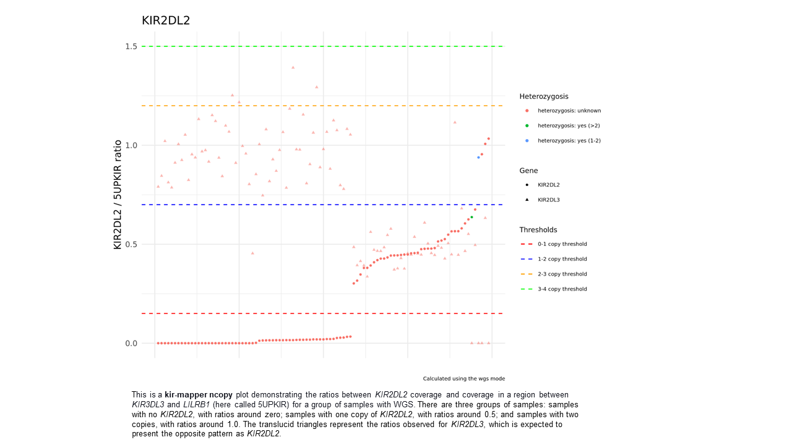

kir-mapper manual
=======

Version 1.1 (May, 2026), using IPD-KIR version: 2.15

Author: Erick C. Castelli (erick.castelli@unesp.br)


Castelli EC et al. kir-mapper: A Toolkit for Killer-Cell Immunoglobulin-Like Receptor (KIR) Genotyping From Short-Read Second-Generation Sequencing Data. HLA 2025 Mar;105(3):e70092. doi: 10.1111/tan.70092.

***To use this version of kir-mapper, please download the database again. The old database is not compatible with this version, and the alleles were updated to IPD-KIR version 2.15. Do not forget to run `kir-mapper setup` again, or update the database path in the configuration file.***


## Summary

[Update history](#update-history)

[Important notes](#important-notes)

[Install](#install)

[kir-mapper configuration](#kir-mapper-configuration)

[How to use kir-mapper](#how-to-use-kir-mapper)

[-- Aligning reads to the hg38 reference genome - map](#aligning-reads-to-the-hg38-reference-genome---map)

[-- Estimating copy numbers - ncopy](#estimating-copy-numbers---ncopy)

[-- Calling SNPs and alleles - genotype](#calling-snps-and-alleles---genotype)

[-- Calling haplotypes and solving ambuguites - haplotype](#calling-haplotypes-and-solving-ambiguites---haplotype)

[Other methods](#other-methods)

[Practical notes](#practical-notes)

[Support](#support)


## Update history:

The original release was version 1.0.

### Version 1.01:
- Updates to the filter to introduce missing alleles in regions with low read depth.

### Version 1.1:
- Updates on the descriptions of functions and options.
- Implementation of a downsample system for very high-coverage samples.
- Implementation of a way to skip marking duplicates with Picard.
- Updates in the database data and structure. The database from versions 1.0 and 1.01 is not compatible with this new kir-mapper version.
- Calling genotypes only in exonic regions is now much faster than the previous version.
- Increased sensitivity to SNPs at the edge of exons when genotyping only exonic regions, which is essential to reduce ambiguities and missing alleles.
- Support for Oxford Nanopore R10.4.1 data.
- The manual was updated, with a detailed description of all options and flags.

[Back to Summary](#summary)


## Important notes:

Data compatibility: We tested kir-mapper with Illumina short-read data from whole-genome sequencing (WGS), whole-exome sequencing (WES), and targeted sequencing. We also tested it with Oxford Nanopore whole-genomes (R10.4.1 only). It might work with Ion Torrent with some adjustments.

System compatibility: Linux, or WSL2/Linux. We have tested it with Ubuntu 22.04 LTS, and Ubuntu 22.04 LTS under WSL2. Other versions might be compatible. It may work on MacOS, but we haven't tested it.

Read depth: Please note that read depth is essential. We recommend coverage of at least 20x for WGS and 50x for WES. 

Read size: You will get much better results when dealing with a read size larger than 100 nucleotides and paired-end sequencing. kir-mapper is also compatible with single-end sequencing data. The pipeline may produce biased results with shorter reads ( < 100).

Sample size: The minimum sample size we tested for the ncopy and haplotype functions is 50. The sample size is essential for obtaining accurate estimates of copy numbers and haplotypes. 

Always indicate the full path for any input file or output folder. For example, do not use "~" for your home folder.


[Back to Summary](#summary)
<br/><br/>

## Install

Please refer to the [README.md](README.md) for instructions on how to install kir-mapper.

[Back to Summary](#summary)

<br/><br/>

## kir-mapper configuration

Remember, you need a copy of the kir-mapper database to run any analysis. 

```
wget --no-check-certificate https://www.castelli-lab.net/support/kir-mapper_db_latest.zip
unzip kir-mapper_db_latest.zip
```

kir-mapper uses a hidden configuration file (.txt) in your home folder that contains the paths to all necessary programs. If the program cannot find this file, it automatically enters setup mode. You can also call this mode by typing `kir-mapper setup` 

```
kir-mapper setup
```

Follow the instructions provided to indicate the path of all necessary programs. kir-mapper might find the programs automatically. The only exception is the database. 

The setup process will save the configuration file in your home folder.

 This is an example of this file. **USER** must be replaced by your username. You can check it with `nano ~/.kir-mapper`:

	db=/home/USER/kir-mapper/kir-mapper_db_latest/
	samtools=/home/USER/miniconda3/envs/kir-mapper/bin/samtools
	bcftools=/home/USER/miniconda3/envs/kir-mapper/bin/bcftools
	bwa=/home/USER/miniconda3/envs/kir-mapper/bin/bwa
	whatshap=/home/USER/miniconda3/envs/kir-mapper/bin/whatshap
	freebayes=/home/USER/miniconda3/envs/kir-mapper/bin/freebayes
	picard=/home/USER/miniconda3/envs/kir-mapper/bin/picard.jar
	star=/home/USER/miniconda3/envs/kir-mapper/bin/STAR
	shapeit4=/home/USER/miniconda3/envs/shapeit4/bin/shapeit4
	minimap=/home/USER/miniconda3/envs/kir-mapper/bin/minimap2


If you need to specify a different configuration file when running kir-mapper, use the `-config` option to specify the alternative configuration file. Example: 

```
kir-mapper map -config /alternative_path/.kir-mapper
```


[Back to Summary](#summary)
<br/><br/>

## How to use kir-mapper

kir-mapper is a toolkit with methods for alignment, genotyping, and haplotype inference. You can see all functions by running the program without any parameters.
```
kir-mapper
```

These are the commands (or functions) available:


|Command|Description|
|---|---|
|setup|configure kir-mapper|
|map|map/align sequences (WGS, exomes, amplicons)|
|ncopy|estimate KIR gene copy numbers|
|genotype|call SNPs and genotype KIR alleles|
| haplotype|estimate haplotypes and resolve ambiguities|
|group|combine results from multiple map and ncopy runs|
|join|join variants into a single VCF for PLINK|
|select|pre-filter KIR-like reads (also performed by map)|


Four main methods should be used in this specific order:
- map
- ncopy
- genotype
- haplotype


The best practice is to use the following workflow:
- Run `kir-mapper map` for each sample in your dataset;
- Run `kir-mapper ncopy` to determine copy numbers after you have "mapped" all samples from your dataset.
- Run `kir-mapper genotype` to call SNPs and InDels.
- Run `kir-mapper haplotype` to solve ambiguities and call multi-loci haplotypes.
- Compare the results from "genotype" and "haplotype".


[Back to Summary](#summary)
<br><br>

### Aligning reads to the hg38 reference genome - map

This function aligns or realigns reads to KIR genes. Type `kir-mapper map` to check all options.

***kir-mapper supports both BAM files and FASTQ files as input. However, it is much faster if the input file is a BAM. If your input is FASTQ files, the best practice is to align the reads to the hg38 reference genome using BWA-MEM, producing a sorted BAM file and its BAI index. Use the same hg38 reference used by the 1000 Genomes Project. Then, use this BAM file as input to kir-mapper. Attention: Always provide the full paths for the input files and the output folder.***


The following is a full description of each `kir-mapper map`option.

```
Program:   kir-mapper::map
Version:   1.1, May 18th 2026

Usage:
  kir-mapper map -bam your.bam [-sample name] [-output dir] <options>
  kir-mapper map -r1 R1.gz -r2 R2.gz [-sample name] [-output dir] <options>
  kir-mapper map -r0 R0.gz [-sample name] [-output dir] <options>

Mandatory options:
  -bam         a BAM/CRAM file (ignore r0/r1/r2)
       or
  -r1          forward FASTQ for paired-end reads (.fq, .fastq, .gz)
  -r2          reverse FASTQ for paired-end reads (.fq, .fastq, .gz)
       or
  -r0          FASTQ for single-end reads (.fq, .fastq, .gz)

Other options:

  -sample      sample name [same as input file if not indicated]
               You can indicate a sample name. All reads will be assigned to 
			   this read group. This will be the name of your sample in all
			   reports and VCF files. kir-mapper can automatically infer the
			   sample name from the BAM filename by removing the .bam,
			   .fastq, or .fastq.gz extensions.

  -db          path to the kir-mapper database
               If you want to use a different database than the one specified
			   in the configuration step, specify the new database here. 

  -output      output folder [same as input file if not indicated]
               Indicate an output folder. kir-mapper will create this folder,
			   and put the new alignment under your_folder/map/sample_name. If
			   not indicated, kir-mapper will create a folder named
			   "kir-mapper" next to the BAM or fastq file used as input.

  -threads     number of threads [16]
               The default value is always half the available cores, up to a
			   maximum of 20. To modify this number, you have to edit the
			   source code. However, we do not recommend higher values since
			   the gain would be minimal.

  -buffer      number of sequences in buffer [1000000]
               This is the number of sequences loaded at the same time.
			   You can modify this value, but this is an optimal trade-off
			   between memory and speed.


  -error       error probability threshold for base quality trimming [0.08]
               kir-mapper searches for sequence stretches in which all bases
			   present this minimum quality and uses only this part of the
			   sequence to guide the alignment. Increase this fraction for
			   Nanopore and Ion Torrent sequencing data. This value is
			   optimized for Illumina sequencing. 

  -tolerance   fraction of mismatches allowed [0.05 Illumina, 0.1 Nanopore]
               Any read with more than this fraction of mismatches in relation
			   to all known KIR sequences will not be considered as a potential
			   KIR-related read.

  -downsample  read depth for downsampling when adjusting reads [30]
               kir-mapper automatically downsamples the sequencing data when
			   read depth is too high. This downsampled file is used only to
			   detect the two closest KIR sequences that fit the data and help
			   kir-mapper to recover some missing reads. We call this process
			   the "adjustment" phase. The final BAM file is not downsampled.


Flags:

  --skip-unmapped   skip retrieving unmapped reads [not recommended]
                    By default, and when using BAM files as input, kir-mapper
					extracts unmapped reads and tests if they might be
					KIR-related sequences. This flag turns off this function
					(not recommended).

  --skip-adjust     skip the adjustment procedure [not recommended]
                    By default, kir-mapper searches for two KIR alleles per
					locus that fit the observed data, and uses this sequence to
					recover reads that present more than one possible alignment
					location. This flag turns off this function.


  --skip-markdup    skip marking duplicates with Picard
                    When indicated in the configuration step, kir-mapper uses
					Picard to mark duplicates. This flag turns off this
					function. This is particularly useful when you are aligning
					that with a high level of duplication, such as libraries
					enriched by PCR.
					
  --low-mem         enable low-memory mode for sequence selection
                    Uses a low-memory mode to select KIR-like sequences. This
					flag forces kir-mapper to use less memory, but the analysis
					will take much longer.
					
  --exome           input is whole-exome sequencing data (exons only)
                    The input you are processing (BAM or FASTQ) came from
					whole-exome sequencing. kir-mapper will analyze only exons
					and apply a different filter to detect variants. Always
					include this flag when analyzing exomes.

  --quiet           quiet mode
                    Do not output the progress or warnings.
  
```


This is an example of a sample tagged as "Test." "Test" will be the name of the sample in all outputs.
```	
# Re-aligning a BAM file
kir-mapper map -bam original_BAM.bam -sample test -output /home/USER/output 

# Aligning FASTQ 
kir-mapper map -r1 R1.fastq.gz -r2 R2.fastq.gz -sample test -output /home/USER/output

# Re-aligning a BAM file from exome
kir-mapper map -bam original_BAM.bam -sample test -output /home/USER/output --exome

# Re-aligning a BAM file from Oxford Nanopore (ONT)
kir-mapper map -bam original_BAM.bam -sample test -output /home/USER/output --nanopore
```


When evaluating many samples simultaneously, run "kir-mapper map" for each sample, specifying a different sample name but the same output folder Example:

```	
kir-mapper map -bam Teste1_BAM.bam -sample Test1 -output /home/USER/output 
kir-mapper map -bam Teste2_BAM.bam -sample Test2 -output /home/USER/output 
kir-mapper map -bam Teste3_BAM.bam -sample Test3 -output /home/USER/output 
```

Example using GNU Parallel, assuming that all your BAM files are in the same folder:

```	
ls your_bolder/*.bam | parallel -j5 --progress kir-mapper map -bam {} -threads 6 -output /home/USER/output  
```


Examples using the sample data provided in /samples
```	
kir-mapper map -r1 HG00096.R1.fastq.gz -r2 HG00096.R2.fastq.gz -sample HG00096 -output /home/USER/output 
kir-mapper map -r1 HG02461.R1.fastq.gz -r2 HG02461.R2.fastq.gz -sample HG02461 -output /home/USER/output 
kir-mapper map -bam HG00403.KIR.bam -sample HG00403 -output /home/USER/output 
kir-mapper map -bam HG01583.KIR.bam -sample HG01583 -output /home/USER/output 
```


The outputs from `map` are placed in a folder named "map" inside the output folder. Inside the "map" folder, you will find a folder for each sample processed using the same output but with different sample names. 

The outputs include BAM files with aligned reads to the hg38 reference genome and gene-specific fastq files. The final BAM is the ".adjusted.bam" when not using Picard for marking duplicates, or ".adjusted.nodup.bam" when using it. 

The BAM files produced by kir-mapper may be used in downstream analysis, such as GATK or freebayes genotyping.

You may inspect the BAM files using [IGV](https://igv.org/). In IGV, change the genome for "Human (hg38 1kg/GATK)" and open the ".adjusted.bam" or ".adjusted.nodup.bam" file. For KIR genes annotated at the main chr19 sequence (e.g., KIR3DL3), type the gene name to locate it. For genes that are not annotated at the main chr19 chromosome, their locations in alternative contigs are as follows:

- KIR2DL2,	chr19_KI270921v1_alt:53185-67900
- KIR2DL5AB, chr19_KI270921v1_alt:175661-185557
- KIR2DS1, chr19_KI270921v1_alt:204223-218437
- KIR2DS2, chr19_KI270921v1_alt:36890-51500
- KIR2DS3, chr19_KI270921v1_alt:81118-95700
- KIR2DS5, chr19_KI270890v1_alt:36829-52100
- KIR3DP1, chr19_KI270923v1_alt:61981-67693
- KIR3DS1, chr19_KI270921v1_alt:159375-174162

<br/>

Files produced by the `map` function:

|File|Description|
|---|---|
|.ajusted.bam|BAM file with all reads - you should use this one
|.adjusted.nodup.bam|BAM file with all reads, with duplicated reads marked by Picard - you should use this one|
|.unique.bam|BAM file with only uniquely mapped reads|
|.unique.nodup.bam|BAM file with only uniquely mapped reads and mark duplicates|
|.kir-mapper.log|Log file with configuration and sample details|
|addressing_table.txt.gz|Table with all reads and the score for each KIR gene|
|GENE.fastq.gz|Gene-specific fastq files.|
|presence_report.txt|report indicating which KIR gene is present. It does not indicate copy numbers.|


***When visualizing kir-mapper BAM files in IGV, keep in mind that two classes of reads are marked to be hidden from genotyping tools. Reads mapping to more than one location are flagged as secondary alignments. Picard marks PCR/optical duplicates. Both classes are excluded from genotyping tools such as FreeBayes, even though they are still part of the true alignment. Because IGV does not hide these reads by default, the displayed coverage will appear higher than the actual sequencing depth considered in downstream analysis. Therefore, to give the user a true sense of the alignment and how the genotyping tools will handle it, turn off secondary and duplicated reads in IGV.***


***After that, if you are experiencing very low read depth with high-coverage sequencing data, try turning off mark duplicates with Picard (--skip-markdup). Sequencing libraries enriched by PCR are usually not compatible with Picard's MarkDuplicates.***

[Back to Summary](#summary)

<br><br>

### Estimating copy numbers - ncopy

This function estimates the number of copies for each KIR gene and sample. The `map` function must be applied before `ncopy` to each sample. 

**Attention: kir-mapper tries to estimate copy numbers for LILR genes (LILRB1, LILRB2, etc). However, this is still in beta mode and the results should not be considered.**

The following is a full description of each `kir-mapper ncopy`option.

```
Usage:     kir-mapper ncopy -output map_output_folder <options>

Mandatory options:
  -output      output folder (same as map and ncopy)
               Indicate an output folder. It must be the same used by the
			   kir-mapper map function.

Other options:
  -db          path to the kir-mapper database
               If you want to use a different database than the one specified
			   in the configuration step, specify the new database here. 

  -threads     number of threads [N]
               The default value is always half the available cores, up to a
			   maximum of 20. To modify this number, you have to edit the
			   source code. However, we do not recommend higher values since
			   the gain would be minimal.

  -reference   KIR3DL3,5UPKIR,HLA-E,HLA-G [default: KIR3DL3]
               There are 4 available references. kir-mapper assumes that all
			   individuals present 2 copies of that reference. If not using the
			   default KIR3DL3, you need to indicate which reference to use
			   (-reference HLA-G, for instance). Reference 5PKIR is a region
			   upstream of KIR3DL3, but it does not include KIR3DL3. Keep in
			   mind that kir-mapper will only work if at least one of these
			   references is available. 5PKIR is only available for
			   whole-genome analyses. Please use the default KIR3DL3 reference
			   whenever possible.

  -samples     text file listing the samples to be considered
               A list of samples to include in this analysis. By default, the
			   kir-mapper processes all samples in the specified output folder.

  --exome      only exons
               The input you are processing (BAM or FASTQ) came from
			   whole-exome sequencing. kir-mapper will analyze only exons
			   and apply a different filter to detect variants. Always
			   include this flag when analyzing exomes.

  --quiet      quiet mode
               Do not output the progress or warnings.
```


Examples
```	
kir-mapper ncopy -output /home/USER/output 
kir-mapper ncopy -output /home/USER/output --exome
kir-mapper ncopy -output /home/USER/output --exome -reference 5UPKIR
```


<br>
The outputs from `ncopy` are placed in an "ncopy" folder inside the output folder. 

This function estimates the number of copies for each KIR gene and sample. The final outputs are plots in PNG and HTML formats with the coverage ratio between the target gene and the selected reference. 

The user must evaluate the thresholds, as the default thresholds might not fit the user's data. To evaluate the thresholds, open the .html files from the output/ncopy/plots directory using any browser. For each gene, define the thresholds to separate samples with 0, 1, 2, 3, or >3 copies, changing these thresholds in the thresholds.txt file inside output/ncopy. Each threshold is separated by ":".

If you change any threshold value, you must run the same `kir-mapper ncopy` command again used to generate the previous version to update all the plots and the copy numbers.

This is an example of a plot produced by kir-mapper, and how the thresholds should be defined to separate the groups.




<br/>
Alternatively, you can use the R script named `kir-mapper_plot_app.R` inside the output/ncopy folder. This script can help you define thresholds and update the plots. When using this script, there is no need to run `ncopy` again if you change any thresholds. To run it, use `Rscript kir-mapper_plot_app.R`.

<br/>
Inside the " ncopy " folder, you will find some files that might be useful:

|File|Description|
|---|---|
|copy_numbers.table.txt|copy numbers in a table format|
|copy_numbers.txt|copy numbers in a list format|
|depth_values.txt|the depth of coverage observed in each gene|
|ratio_values.txt|the target/referece ratios|
|presence.table.txt|presence or absence of each gene in a table format|
|presence.table.vcf|presence or absence of each gene in a VCF format|
|thresholds.txt|the thresholds used to separate groups|
|kir-mappler_plot_app.R|the script for changing the thresholds|
|/plots| all the plots in HTML and PNG formats|


***Tip: It is easier to define the threshold in a set of samples that are more homogeneous with respect to genomic ancestry. If you are processing a large sample set and can separate the samples by genomic ancestry, it will be easier to define thresholds and KIR copy numbers. In addition, do not run ncopy with samples sequenced on different platforms. If you are processing data from different platforms (WGS, Exomes), evaluate each group separately.***

[Back to Summary](#summary)

<br>

### Calling SNPs and alleles - genotype

This function will call SNPs and InDels across KIR genes, phase them using WhatsHap, and evaluate how these SNPs and haplotypes align with known KIR alleles. 

The following is a full description of each `kir-mapper genotype`option.

```	
Usage:     kir-mapper genotype -output output_folder <options>

Mandatory options:
  -output          output folder (same as map and ncopy)

Other options:

  -db              path to the kir-mapper database
                   If you want to use a different database than the one
				   specified in the configuration step, specify the new
				   database here.

  -threads         number of threads [N]
                   The default value is always half the available cores, up to a
			       maximum of 20. To modify this number, you have to edit the
			       source code. However, we do not recommend higher values since
			       the gain would be minimal.

  -target          restrict genotyping to a specific gene (e.g., KIR2DL1)
                   By default, kir-mapper genotypes all KIR genes. Use this
				   option to restrict to a single gene or list of genes (e.g.,
				   -target KIR2DL1,KIR2DL2). Do not use spaces after the comma.

  -config          path to a kir-mapper configuration file
                   If you need to specify an alternative kir-mapper
				   configuration file with different paths for samtools,
				   freebayes, etc., indicate it here.
                   
Flags:

  --full           full genotyping, including intronic regions
                   Force kir-mapper to call SNPs and haplotypes in all exons
				   and introns.

  --quiet          quiet mode
                   Do not output the progress or warnings.

  --no-polyphase   disable phasing for tri/tetraploid samples
                   kir-mapper tries to phase variants in genes with 3 or 4
				   copies. This is still unstable, and you can turn off this
				   feature with this flag.

  --two-copies     force diploid copy number when the gene is present
                   Assume that all genes present two copies, even if ncopy
				   tells a different story or if ncopy data is not available.

  --update-calls   update allele calls while retaining the existing VCF
                   If you already run kir-mapper and have modified the final
				   .phased.vcf file, you can use this flag to update the allele
				   calls without rerunning freebayes.


  --skip-markdup   skip marking duplicates with Picard
                   When indicated in the configuration step, kir-mapper uses
				   Picard to mark duplicates. This flag turns off this
				   function. This is particularly useful when you are aligning
				   that with a high level of duplication, such as libraries
				   enriched by PCR.
```


Note that you must indicate the same output folder used in the previous step (map and ncopy).
<br>

The outputs from `genotype` are placed in a " genotype " folder inside the output folder. By default, variants are called only in exons and placed under the folder " genotype/cds ". When using `--full`, variants are placed under the folder " genotype/full ".

The outputs are VCF files for each gene and reports listing the detected alleles for each sample, including any mismatches.

The VCF files are placed inside output/genotype/cds/[GENE_NAME]/vcf

The reports for each sample are placed inside output/genotype/cds/[GENE_NAME]/reports

The summary with all allele calls is placed inside output/genotype/cds/[GENE_NAME]/calls

All the SNPs are reported in the context of the hg38 reference genome. For genes not annotated in the primary sequence of chr19 (e.g., KIR2DL5), reads from these genes are aligned and reported in an alternative contig.

These are the locations for all genes in the alternative contigs:

- KIR2DL2,	chr19_KI270921v1_alt:53185-67900
- KIR2DL5AB, chr19_KI270921v1_alt:175661-185557
- KIR2DS1, chr19_KI270921v1_alt:204223-218437
- KIR2DS2, chr19_KI270921v1_alt:36890-51500
- KIR2DS3, chr19_KI270921v1_alt:81118-95700
- KIR2DS5, chr19_KI270890v1_alt:36829-52100
- KIR3DP1, chr19_KI270923v1_alt:61981-67693
- KIR3DS1, chr19_KI270921v1_alt:159375-174162


This is an example of the report for a sample named Test and gene KIR2DL1. Reports are placed at the output folder inside output/genotype/cds/[GENE_NAME]/reports


|Sample|Copy_number|Chr|Allele_A|Allele_B|Allele_C|Allele_D|Tested_genotypes|Valid_genotypes|Error_list|Missed_genotypes|Missed_list|Ratio|
|---|---|---|---|---|---|---|---|---|---|---|---|---|
|Test|1|chr19|KIR2DL1.01202|KIR2DL1*null|NA|NA|77|77|none|0|none|1.000000|
|Test|1|chr19|KIR2DL1.00303|KIR2DL1*null|NA|NA|81|80|54775198|1|54784020|0.987654|

In this case, the Test sample has only one copy of KIR2DL1, which is compatible with the KIR2DL1\*01202 allele. It tested 77 SNPs, and 77 SNPs were compatible with this allele. There were no missing variants or mismatches, and the proportion of valid variants / tested variants was 1.00 (100%). There is a second record for allele KIR2DL1\* 00303, but in this case, there is one mismatch at chr19:54775198 and one missing variant at chr19:54784020. The ratio of valid variants to tested variants (80/81) was 0.9876. You can inspect missing alleles and mismatches by using IGV and the BAM files produced by `kir-mapper map`.

After analyzing all samples, kir-mapper will produce a summarized report with all samples. This report is at output/genotype/cds/[GENE_NAME]/calls/[GENE_NAME].calls.txt. This report will present the best fit for each sample. In case there are too many alleles for a sample (due to mismatches of missing variants), you may find the indication of "*unresolved".


 Example:
|Sample|Copy_number|Calls|Ratio|Missings|
|---|---|---|---|---|
|Test|1|KIR2DL1.01202+KIR2DL1*null|1|0|
|Test2|2|KIR2DL1*00302+KIR2DL1*00401;KIR2DL1*00302+KIR2DL1*035|1|1|


**Attention: You should not consider calls with too many missing variants. Missing variants occur when the read length is too short (<100) or the coverage is too low (<20 for WGS, <50 for WES). In addition, calls with a ratio < 1 indicate possible new alleles, and the allele combination indicated is the closest one.**


Sometimes, `kir-mapper genotype` reports ambiguities, i.e., more than one combination of alleles that fit the observed genotypes. This was observed above for sample Test2. The following method, `kir-mapper haplotype,` may solve ambiguities. If there are too many allele combinations, kir-mapper will indicate "*unresolved".

**However, ambiguities are highly minimized because kir-mapper tries to phase all heterozygous sites with whatshap and considers the phasing status when comparing the data with known alleles. However, this process sometimes fails (e.g., at distant heterozygous sites).**


***Tip: You can inspect the kir-mapper VCF and BAM files simultaneously in IGV by setting hg38 as the reference.***


[Back to Summary](#summary)


### Calling haplotypes and solving ambiguites - haplotype

This method will use shapeit4 to call haplotypes within KIR genes and among KIR genes (all SNPs and InDels will be phased). This function will not work properly with fewer than 100 samples, and it is not available for fewer than 20 samples. It generates predicted sequences for each gene and sample, then compares them with those in the IPD-KIR database.

```	
Usage:     kir-mapper haplotype -output kir-mapper_output_folder <options>

Mandatory options:
  -output          output folder (same as map and ncopy)

Other options:
  -db              path to the kir-mapper database
                   If you want to use a different database than the one
				   specified in the configuration step, specify the new
				   database here.
  
  -threads         number of threads [N]
                   The default value is always half the available cores, up to a
			       maximum of 20. To modify this number, you have to edit the
			       source code. However, we do not recommend higher values since
			       the gain would be minimal.

  -replicates      number of replicates [N]
                   kir-mapper runs shapeit4 this number of times and compares
				   the resulting haplotypes. The P-value reported reflects how
				   many times the haplotype was detected across all runs.
                   
  -tag             tag to differentiate multiple haplotype runs
                   Add this tag to identify the run. It will create a different
				   output folder. E.g., -tar centromeric

  -target          list of target genes (e.g., KIR2DL4,KIR3DL3)
                   By default, kir-mapper genotypes all KIR genes. Use this
				   option to restrict to a single gene or list of genes (e.g.,
				   -target KIR2DL1,KIR2DL2). Do not use spaces after the comma.

  --cds           include only the CDS (no 3'UTR) - default
                  Include all translated exons in the haplotyping step.

  --exons         include exons and 3'UTR - need genotype --full
                  Include all exons and UTR regions in the haplotyping step.
				  To use this, you need to run kir-mapper genotype with the
				  full mode activated (--full).


  --telomeric     limit target to telomeric genes
                  Set the -target option to all genes in the telomeric region.

  --centromeric   limit target to centromeric genes
                  Set the -target option to all genes in the centromeric region.

  --force         bypass the minimum number of samples
                  Forces kir-mapper to run shapeit4 with few samples.
				  Not recommended.

  --quiet         quiet mode
                  Do not output the progress or warnings.
```	

Examples
```	
kir-mapper haplotype -output /home/USER/output
kir-mapper haplotype -output /home/USER/output --centromeric
kir-mapper haplotype -output /home/USER/output -target KIR3DL3,KIR2DL4
```


The outputs are phased VCFs and reports with the detected alleles for each sample and how these alleles are arranged across chr19.

**Attention: the phased VCF uses dummy/fake positions, keeping the expected order of each gene and SNP. Do not use this VCF or consider these positions.**


This is an example of the files produced by the `haplotype` function. They will be placed at the output folder inside /haplotype, /haplotype_centromeric, or /haplotype_telomeric.


|File|Description|
|---|---|
|/shapeit4|The outputs from Shapeit4|
|fake_diploid_for_shapeit4.bi.vcf.gz|A VCF file with all SNPs and Indels, but using dummy positions. |
|fake_diploid_phased...|Chromosome-specific VCF with phased genotypes, but using dummy positions|
|[GENE].fas|The sequences observed for this gene. H1 is the haplotype at the left of the phased VCF, H2 is the haplotype at the right.|
|[GENE].names.fas|One copy of each different sequence and the name associated with them.|
|[GENE].db.txt|A database with the observed haplotypes for each sample, the sequence, and the name of the allele|
|merged_one_line_per_chromosome.db.txt|This database contains the observed alleles for each sample, with vector h1 representing one chromosome and h2 the other. Each chromosome is in a different line. All alleles under the same vector (same line) belong to the same chromosome. Fields call, ratio, and miss represent the genotypes obtained with the genotype function. haplotype_P_value represents an empirical P value for this haplotype, based on the number of replicates performed (0.9 means that this haplotype was detected 18 times over the 20 replicates).|
|merged_two_chromosomes_per_line.db.txt|This database contains the observed alleles for each sample, with vector h1 representing one chromosome and h2 the other. Each line contains both chromosomes. All alleles under the same vector (h1 or h2) belong to the same chromosome. Fields call, ratio, and miss represent the genotypes obtained with the genotype function. haplotype_P_value represents an empirical P value for this haplotype, based on the number of replicates performed (0.9 means that this haplotype was detected 18 times over the 20 replicates).|


After running `kir-mapper haplotype`, the user must compare the results from the `haplotype` function (h1 and h2) with those from the `genotype` function (call, ratio, miss). Usually, h1 and h2 will indicate alleles also identified by the `genotype` function.


[Back to Summary](#summary)
<br/><br/>

## Other methods 

### Function group

It combines multiple map and ncopy runs in a single output structure. For instance, you can run `kir-mapper map` for all samples from population A, and `kir-mapper ncopy` to define population A's thresholds. After that, you can do the same for population B. To call SNPs and alleles in populations A and B simultaneously, you can use this function to join both populations in a single kir-mapper output. After, you can call the 'genotype' and 'haplotype' functions on this single output.


### Function join

Join variants from all genes in a single VCF file for use with Plink or other downstream analysis.


### Function select

To extract reads related to KIR genes from FASTQ or BAM files. However, not all reads are KIR. You should use the map function to get gene-specific reads. The `kir-mapper map` function automatically applies this function. 
<br/>

### Function setup

Configure (or re-configure) kir-mapper.

[Back to Summary](#summary)
<br/><br/>

## Practical notes

### Custom database, with alleles that are not in the IPD-KIR database 
For now, it is not possible to add new alleles to kir-mapper. We will update the database regularly. Please get in touch with the author if you need to add something.

### Evaluating samples from different ancestry backgrounds 
We do not recommend applying `kir-mapper ncopy` to samples from different populations simultaneously. The thresholds vary widely across populations. In our tests, we applied `kir-mapper map` and `kir-mapper ncopy` in all samples from Europe, Africa, etc., separately. Afterward, we grouped all samples using `kir-mapper group` to create a kir-mapper output with all samples before running `kir-mapper genotype`.

### Always check a few BAM files before processing large datasets
Always analyze a few samples and check the BAM files in IGV before continuing with large datasets. To do that, turn off secondary and duplicate reads on IGV. You might need to adjust the map function, such as turning off Picard markduplicates (--skip-markdup).


### Warning for ONT data

When dealing with Oxford Nanopore data, kir-mapper extracts the fragment corresponding to a KIR gene from large reads and renames it. Therefore, the final BAM alignment does not represent the original FASTQ data. The read size is maintained as large as possible to facilitate the definition of internal haplotypes. Still, they do not contribute to the definition of haplotypes between genes.


## Support

Create a [GitHub issue](https://github.com/erickcastelli/kir-mapper/issues).

