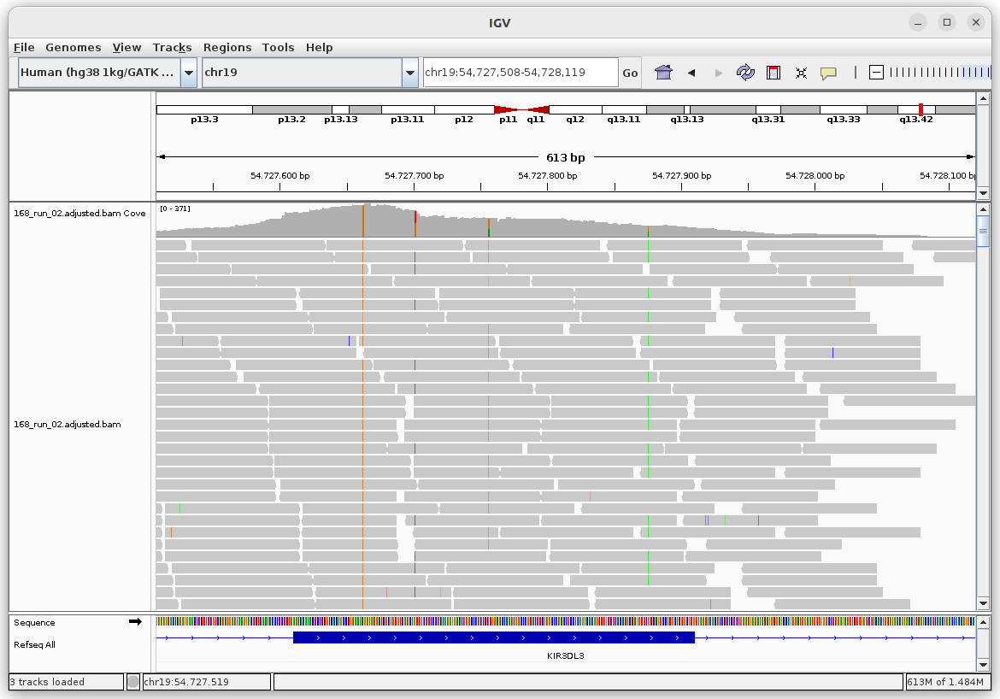

kir-mapper workflow for Illumina Whole Exomes (WES)
=======

Version 1.1 (May, 2026), using IPD-KIR version: 2.15

Author: Erick C. Castelli (erick.castelli@unesp.br)


Please cite: 

Castelli EC et al. kir-mapper: A Toolkit for Killer-Cell Immunoglobulin-Like Receptor (KIR) Genotyping From Short-Read Second-Generation Sequencing Data. HLA 2025 Mar;105(3):e70092. doi: 10.1111/tan.70092.

For full details on how to use kir-mapper, please check kir-mapper documentation [MANUAL.md](MANUAL.md)


## Important notes:

We recommend a minimum of 50X. 

Larger samples facilitate the definition of thresholds when assigning copy numbers. 


## Step 1: Mapping/Aligning reads

For whole exome (WES) Illumina data, you need a BAM file with reads aligned to the hg38 reference genome. Use the same reference as the 1000 Genomes Project (+decoys). Use BWA MEM to align your reads against the reference.

**If you have a CRAM file, first convert it to BAM.**

Align each sample using a similar command as the one below:
``` 
kir-mapper map -bam original_BAM.bam -sample test -output /output_folder --exome
```

When evaluating many samples simultaneously, run `kir-mapper map` for each sample, indicating a different sample name (-sample) and the same output folder for all of them. You can run multiple instances of kir-mapper with the same output folder, but the sample names must be different..


You may inspect the BAM files using [IGV](https://igv.org/). In IGV, change the genome for "Human (hg38 1kg/GATK)" and open the file ".adjusted.bam" or ".adjusted.nodup.bam". For KIR genes annotated at the main chr19 sequence (e.g., KIR3DL3), type the gene name to locate it. For genes that are not annotated on the main chromosome 19, their locations in alternative contigs are as follows:

- KIR2DL2,  chr19_KI270921v1_alt:53185-67900
- KIR2DL5AB, chr19_KI270921v1_alt:175661-185557
- KIR2DS1, chr19_KI270921v1_alt:204223-218437
- KIR2DS2, chr19_KI270921v1_alt:36890-51500
- KIR2DS3, chr19_KI270921v1_alt:81118-95700
- KIR2DS5, chr19_KI270890v1_alt:36829-52100
- KIR3DP1, chr19_KI270923v1_alt:61981-67693
- KIR3DS1, chr19_KI270921v1_alt:159375-174162


When visualizing kir-mapper BAM files in IGV, keep in mind that two classes of reads are marked to be hidden from genotyping tools. Reads mapping to more than one location are flagged as secondary alignments. Picard marks PCR/optical duplicates. Both classes are excluded from genotyping tools such as FreeBayes, even though they are still part of the true alignment. Because IGV does not hide these reads by default, the displayed coverage will appear higher than the actual sequencing depth considered in downstream analysis. Therefore, to give the user a true sense of the alignment and how the genotyping tools will handle it, turn off secondary and duplicated reads in IGV.

**Attention: Do not forget to add `--exome`**


## Step 2: Estimating copy numbers

Once all samples were aligned in the previous step, you need to assign copy numbers to them. This is mandatory, even when analyzing just one sample, since the `genotype` function will not work without it.

How to assign copy numbers:
``` 
kir-mapper ncopy -output /output_folder --exome
```

Open the file `/output_folder/ncopy/thresholds.txt`. These are the thresholds used, which are usually the default ones. Each value is separated by a ":".

Open the .html files in `/output_folder/ncopy/plots` in a browser. Define the thresholds to separate samples into 0, 1, 2, 3, or >3 copies, and update them in thresholds.txt.

Once finished, save the thresholds.txt file, and run ncopy again with the same command shown above to update all plots and copy numbers for all samples.

**With exomes, selecting thresholds is not an easy or straightforward task. Probe capture bias can lead to unexpected results, as copy number variation is estimated from read depth, and each library preparation kit may introduce its own bias. If you are experiencing problems defining the thresholds, you may try selecting different regions within each locus for the calculation of read depth. To modify these regions, you need to edit the file ncopy/targets.cds.txt inside the kir-mapper database.**


This is an example of capture bias in exomes, in which the beginning of the exon has much higher coverage than the end.



## Step 3: Calling SNPs and alleles


This option analyses all the KIR genes:
``` 
kir-mapper genotype -output /output_folder --exome
```

You can also restrict the analysis to a specific set of genes (e.g., `-target KIR2DL1,KIR2DL2`).


For each gene, you have some important files to explore. This is an example with KIR2DL4, placed under /output_folder/genotype/cds/KIR2DL4 when not indicating the --full mode:


|File|Description|
|---|---|
|calls/KIR2DL4.calls.txt|a summary of the best allele calls for each sample|
|reports/|detailed reports for each sample, with missing alleles, compatibility, mismatches, and others.|
|vcf/KIR2DL4.combined.trim.treated.norm.phased.vcf|the phased VCF file with variants in the hg38 context|


Sometimes, `kir-mapper genotype` reports ambiguities, i.e., more than one combination of alleles that fit the observed genotypes. The following method, `kir-mapper haplotype,` may solve ambiguities. If there are too many allele combinations, kir-mapper will indicate "*unresolved".

***Tip: You can inspect the kir-mapper VCF and BAM files simultaneously in IGV by setting hg38 as the reference.***


## Step 4: Calling haplotypes and solving ambiguites

If necessary, you can use this method to call haplotypes and solve the ambiguities.

Run both these commands:

``` 
kir-mapper haplotype -output /output_folder -tag cen --nanopore --centromeric
kir-mapper haplotype -output /output_folder -tag tel --nanopore --telomeric
```

You will find the haplotypes for the centromeric genes at /output_folder/haplotypes_cen/cds. 

You will find the haplotypes for the telomeric genes at /output_folder/haplotypes_tel/cds. 

**Attention: the phased VCF uses dummy/fake positions, keeping the expected order of each gene and SNP. Do not use this VCF or consider these positions.**

After running `kir-mapper haplotype`, the user must compare the results from the `haplotype` function (h1 and h2) with those from the `genotype` function (call, ratio, miss). Usually, h1 and h2 will indicate alleles also identified by the `genotype` function.


## Known issues

